lu401exam
=========

# Table of Contents

1. [Channel capacity calculation](#channel-capacity-calculation)
2. [Pulse code modulation](#pulse-code-modulation)
3. [Matched filter](#matched-filter)
4. [Adaptive quantiser](#adaptive-quantiser)
5. [ASK modulation](#ask-modulation)
6. [Common scheme](#common-scheme)

## Channel capacity calculation

Channel capacity is the tightest upper bound on the rate of information that can be reliably transmitted over a communications channel.

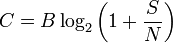

`S/N` is signal to noise ratio (ratio of signal power to noise power).

`B` Hz bandwidth.

`C` is measured in bits per second if the logarithm is taken in base 2, or nats per second if the natural logarithm is used, assuming `B` is in hertz.

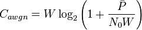

`P` is average received power. `N` is noise power spectral density. `P/WN` is received SNR.

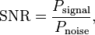

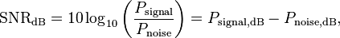

## Pulse code modulation

Pulse code modulation (PCM) is a digital representation of an analog signal that takes samples of the amplitude of the analog signal at regular intervals. The sampled analog data is changed to, and then represented by, binary data.

PCM requires a vey accurate clock.

The PCM process includes three steps:
1. Sampling
2. Quantisation
3. Coding

In the sampling process, the magnitude of the analog signal is sampled regularly at uniform intervals. The obtained values are called samples.

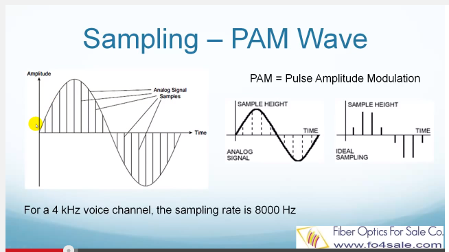

Quantisation is the process of converting the obtained samples into discrete digital values. The most basic type of quantisation is called uniform quantisation.

In an uniform quantisation, the vertical axis, which represents the amplitude, is divided into equal sized steps. As shown in the following figure, the range between 1 volt and -1 volt is divided into 16 steps, each step represents 0.125 volt.

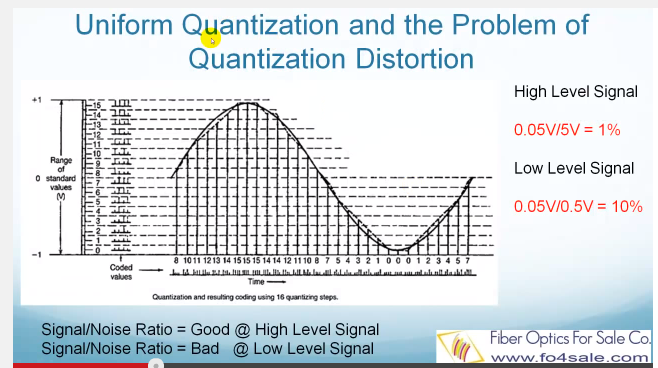

In non-uniform quantisation process, the steps are not of equal size. Small steps are used for small signal values and large steps for large values. The purpose of doing so is to achieve that the signal-to-noise ratio is nearly independent of the signal level.

This is done by favouring low-level voice over higher-level voice. In other words, more code groups are assigned to speech at low levels than at the higher levels, progressively more as the level reduces.

There are two types of non-uniform quantisation methods in popular use today. They are the A-law and the u-law. Let's first look at the A-law.

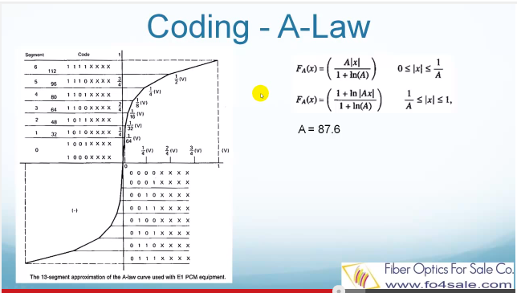

We can see that the curve consists of linear piecewise segments, seven above and seven below the origin. The segment just above and the segment just below the origin consists of two linear segments. Counting the collinear elements by the origin, there are 16 segments. Each segment has 16 8-bit PCM codes assigned. These are the codewords that identify the voltage level of a sample at some moment in time.

Each codeword, often called a PCM "word", consists of 8 bits. The first bit tells the receiver if the sample is a positive or negative voltage. We can see that all PCM words above the origin start with a binary 1, and those below the origin start with a binary 0.

The next 3 bits in sequence identify the segment. There are eight segments above the origin and eight below the origin.

The last 4 bits, shown as XXXX, indicate exactly where in a particular segment that voltage line is located.

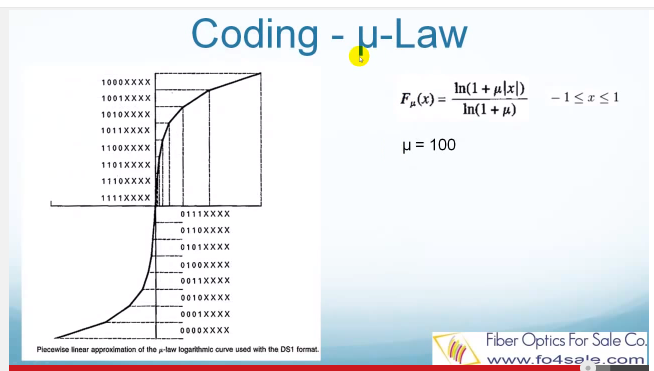

## Matched filter

Matched filter is obtained by correlating a known signal with unknown signal to detect the presence of pattern in the unknown signal.

Matched filter is obtained by correlating a known signal with unknown signal to detect the presence of pattern in the unknown signal.

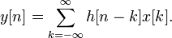

The matched filter is used in communications. that sends binary messages from the transmitter to the receiver across a noisy channel, a matched filter used to detect the transmitted pulses in the noisy received signal.

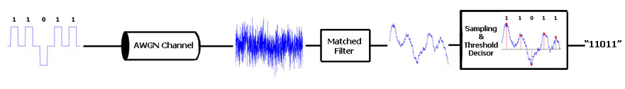

## Adaptive quantiser
Quantiser approximates a continuous signal `x(t)` with a discrete signal `xQ(t)` in order to get a smaller set of input values. It is also an essential aspect of analogue-to-digital conversion.

Quantisation > Scalar > Adaptive (Forward "AQF" and Backward "AQB").

__Scalar quantisation__ is the most common type of quantisation and can be as simple as rounding high-precision numbers to the nearest integers.

The adaptation concept of varying the quantisation (staircase) characteristic with time and in harmony to the local statistics of the input speech signal, can be also represented as follows

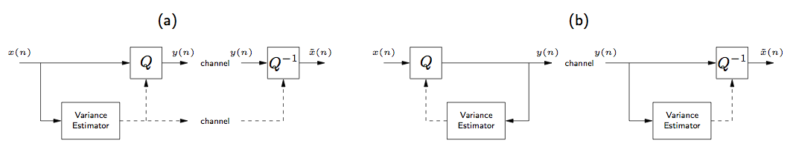

The advantage of __AQF__ is that variance estimation may be accomplished more accurately, as it is operates directly on the source as opposed to a quantised (noisy) version of the source.

The advantage of __AQB__ is that the variance estimates do not need to be transmitted as side information for decoding. However, practical AQF encoders transmit variance estimates only occasionally, e.g., once per block.

There are 2 types of Variance Estimation: _Block Variance Estimation_ and _Recursive Variance Estimation_.

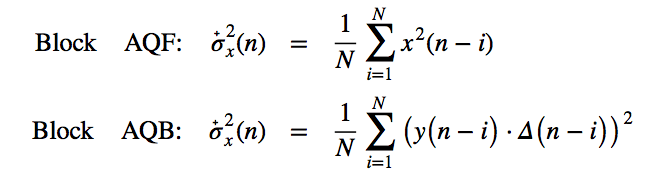

`N` is _learning period_ and its choice may significantly impact quantiser performance: choosing N too large prevents the quantiser from adapting to the local statistics of the input, while choosing N too small results in overly noisy AQB variance estimates and excessive AQF side information.

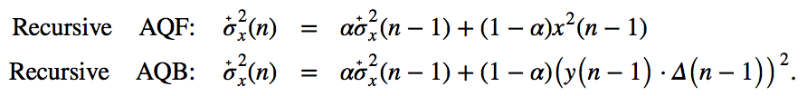

Here `α` is forgetting factor in range `0 < α < 1` and typically near to 1.

## ASK modulation

Modulation is a process of conveying a message e.g. a digital bit stream inside another signal that can be physically transmitted.

ASK modulation is based on amplitude shift keying and uses a finite number of amplitudes.

The binary symbol 1 is represented by transmitting a fixed-amplitude carrier wave and fixed frequency for a bit duration of `T` seconds. If the signal value is 1 then the carrier signal will be transmitted; otherwise, a signal value of 0 will not be transmitted.

PSD (Power Spectral Density) helps to determine how the strength of a signal is distributed in the frequency domain, relative to the strengths of other ambient signals. E.g. for carrier signal `sin(2π100t)` there will be a peak around frequency of 100 Hz.

__Advantages:__ simple / inexpensive modulation and demodulation.

__Disadvantages:__ it is linear and to atmospheric noise, distortion, propagation condition on different routes. Thus it requires excessive bandwidth and is therefore wastes power.

## Common scheme

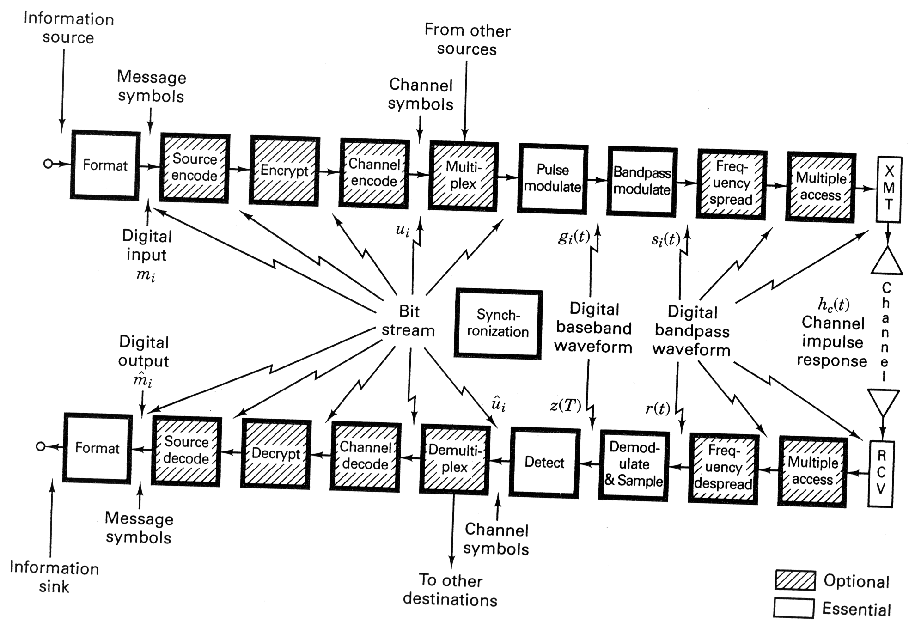
